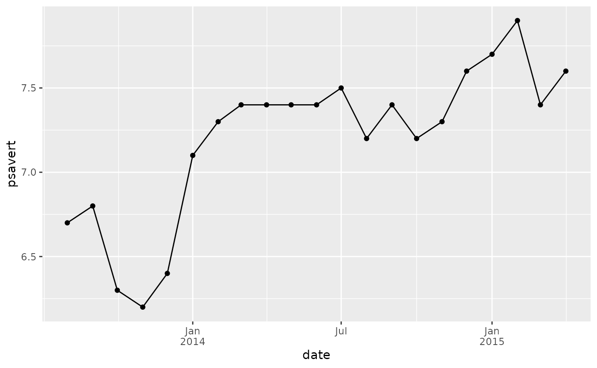
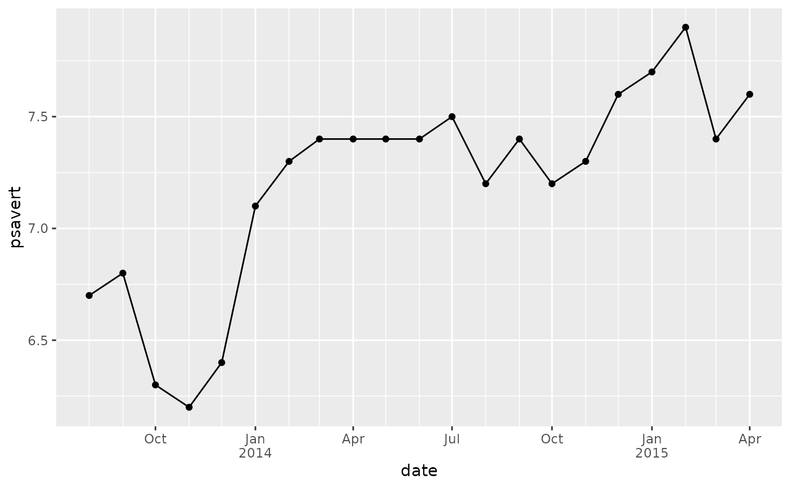
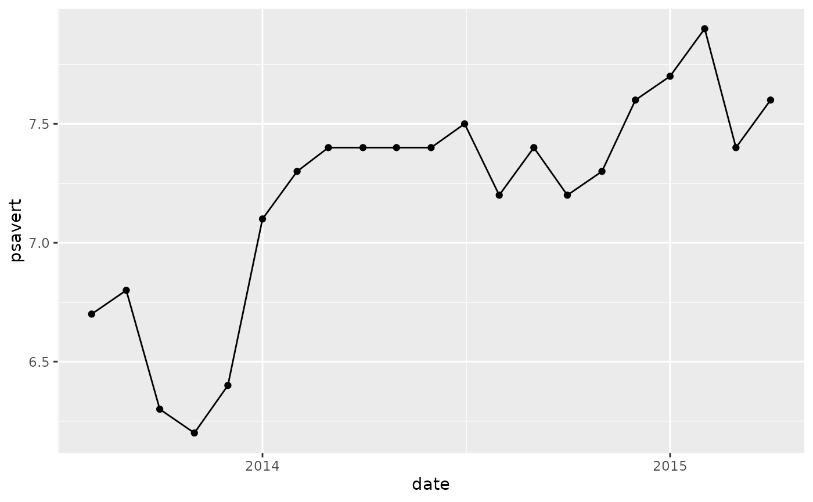
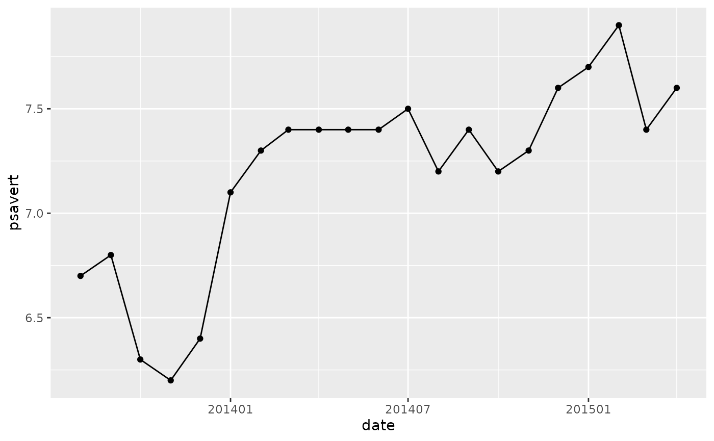

# Introduction to \`{yyyymm}\`

## Example to work with `yyyymm` format

``` r

library(yyyymm)
ym_to_date(ym = c(200902, 201912), day = 1)
#> [1] "2009-02-01" "2019-12-01"


ym_diff(ym = c(200902, 201912), ym2 = c(200901, 201712))
#> [1]  1 24


ym_add_months(c(200902, 201912), months = c(1, -12))
#> [1] 200903 201812


ym_format(c(200902, 201912), "%B %Y")
#> [1] "February 2009" "December 2019"


ym_seq(201303, 201512)
#>  [1] 201303 201304 201305 201306 201307 201308 201309 201310 201311 201312
#> [11] 201401 201402 201403 201404 201405 201406 201407 201408 201409 201410
#> [21] 201411 201412 201501 201502 201503 201504 201505 201506 201507 201508
#> [31] 201509 201510 201511 201512


seqym <- ym_seq(201303, 201512)
seqym
#>  [1] 201303 201304 201305 201306 201307 201308 201309 201310 201311 201312
#> [11] 201401 201402 201403 201404 201405 201406 201407 201408 201409 201410
#> [21] 201411 201412 201501 201502 201503 201504 201505 201506 201507 201508
#> [31] 201509 201510 201511 201512

ym_div(seqym, ng = 3)
#>  [1] 201301 201301 201305 201305 201305 201305 201309 201309 201309 201309
#> [11] 201401 201401 201401 201401 201405 201405 201405 201405 201409 201409
#> [21] 201409 201409 201501 201501 201501 201501 201505 201505 201505 201505
#> [31] 201509 201509 201509 201509

ym_div(seqym, ng = 4)
#>  [1] 201301 201304 201304 201304 201307 201307 201307 201310 201310 201310
#> [11] 201401 201401 201401 201404 201404 201404 201407 201407 201407 201410
#> [21] 201410 201410 201501 201501 201501 201504 201504 201504 201507 201507
#> [31] 201507 201510 201510 201510
```

## `{ggplot2}` helpers

### `date_format_jy` (`scale_x_date` helper)

``` r

library(ggplot2)

economics2 <- subset(economics, date >= lubridate::ymd(20130801))

p <- ggplot(economics2, aes(date, psavert)) +
  geom_line() +
  geom_point() 

p
```


``` r


p +
  scale_x_date(labels = date_format_jy())
```



``` r


p +
  scale_x_date(labels = date_format_jy(date_label = "%m"))
```


``` r


p +
  scale_x_date(
    labels = date_format_jy(),
    date_minor_breaks = "1 month",
    breaks = "3 month"
    )
```



### `scale_x_date_year`

``` r

p + scale_x_date_year()
```


``` r


# fix with
p + scale_x_date_year(date_breaks = "1 year")
```



``` r


p + scale_x_date_year(date_breaks = "1 year", date_minor_breaks = "1 month")
```


``` r


p + scale_x_date_year(date_breaks = "1 year", date_minor_breaks = "3 month")
```


### `scale_x_date_yyyymm`

``` r

p +
  scale_x_date_yyyymm() 
```


``` r


p +
  scale_x_date_yyyymm(
    date_breaks = "6 months",
    date_minor_breaks = "3 month"
    )
```



## Function to validate `yyyymm`

``` r

yyyymm:::is_yyyymm(999)
#> Error in `yyyymm:::is_yyyymm()`:
#> ! ym > 100001 is not TRUE

yyyymm:::is_yyyymm(1111111)
#> Error in `yyyymm:::is_yyyymm()`:
#> ! ym <= 999912 is not TRUE

yyyymm:::is_yyyymm(201900)
#> Error in `yyyymm:::is_yyyymm()`:
#> ! month >= 1 is not TRUE

yyyymm:::is_yyyymm(201913)
#> Error in `yyyymm:::is_yyyymm()`:
#> ! month <= 12 is not TRUE

yyyymm:::is_yyyymm(201913.5)
#> Error in `yyyymm:::is_yyyymm()`:
#> ! ym == as.integer(ym) is not TRUE
```
